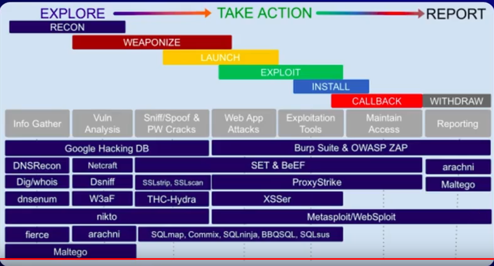

# Tahapan Penetration Testing

## 1. Mendapat NDA(Non-Disclosure Agreement)
-> Perjanjian hukum yang mengikat pihak-pihak (seperti karyawan, vendor, atau konsultan) untuk tidak membocorkan informasi rahasia klien atau perusahaan.

## 2. Tiga Aturan/Triad CIA
**Confidentiality, Integrity, Availability**

1. *Confidentiality(Kerahasiaan)*:
Mengamankan informasi sensitif agar hanya dapat diakses oleh pihak yang berwenang. Ini melibatkan penggunaan enkripsi dan kontrol akses yang ketat.

2. *Integrity(Integritas)*:
Menjaga akurasi dan konsistensi data, memastikan informasi tidak diubah, dirusak, atau dimanipulasi oleh pihak yang tidak sah selama penyimpanan maupun transmisi.

3. *Availability(Ketersediaan)*:
Memastikan sistem, jaringan, dan data selalu dapat diakses dan digunakan oleh pengguna yang berwenang saat dibutuhkan.

## 3. Proses Pentest
```
/================\
| Reconnaissance |
\================/
		|
		▼
   /==========\
   | Scanning |
   \==========/
		|
		▼
/================\
| Gaining Access |
\================/
		|
		▼	
/======================\
| Privilege Escalation |
\======================/
		|
		▼
   /===========\
   | Reporting |
   \===========/
```

### Reconnaissance
**Reconnaissance** (sering disingkat _recon_) secara umum adalah ==tindakan pengintaian, penyelidikan, atau pengumpulan informasi awal mengenai suatu target atau situasi==
Disebut Juga *Foot-Printing/Information Gathering*.

Penggalian Data :
- Umum :
	- Shodan
	- Dirbuster
	- Dirsearch
	- Dirhunt
	- Banner Grabbing
	- whois
	- CMSmap
	- DNS
	- Google Hacking
- Informasi Konfigurasi Jaringan(NMAP)
- Informasi Komputer Yang Terlibat(NMAP)
- Informasi Pengguna Yang Terlibat(Alamat Email)

Dua Jenis Tindakan :
- Aktif(NMAP)
- Pasif(Cari dari Media Sosial, Web Atau Sebagainya secara Manual)

### Scanning
**scanning** adalah ==fase kedua dalam metodologi pengujian keamanan (setelah _footprinting_) di mana peretas etis menggunakan serangkaian alat untuk menganalisis jaringan, host, dan layanan serta memetakan sistem target==.
Tiga Pindaian Yang Dilakukan :
- Memindai Port Komunikasi Terbuka
- Memindai Kelemahan Target
- Pemetaan Jaringan Komputer

### Gaining Access
Mendapatkan Akses untuk menguji eksploitasi kerentanan yang ditemukan pada tahap sebelumnya(Scanning & Reconnaissance) untuk masuk ke dalam sistem, jaringan atau aplikasi target.

Tujuan utamanya adalah membuktikan bahwa celah keamanan yang ditemukan benar-benar dapat disalahgunakan untuk mendapatkan akses, mirip dengan apa yang dilakukan peretas jahat (black hat hacker).

### Privilege Access
Tingkat akses khusus(Administrator/Super User) yang diberikan kepada pengguna, sistem, atau aplikasi untuk melakukan tindakan administratif atau sensitif yang tidak bisa dilakukan oleh pengguna biasa untuk tindakan selanjutnya.

### Reporting
Penyusunan dokumen komprehensif berisi temuan kerentanan, bukti eksploitasi (Proof of Concept), penilaian risiko, dan rekomendasi perbaikan. Laporan ini menjembatani hasil teknis dengan manajemen untuk perbaikan keamanan.

**Poin Penting Reporting Pentest:**
- **ISI Utama:**
Ringkasan eksekutif (untuk manajemen), detail teknis temuan, tingkat risiko (CRITICAL, HIGH, MEDIUM, LOW), langkah perbaikan (remediasi), dan lampiran log.
- **Fungsi:**
Sebagai bukti kepatuhan (PCI DSS, ISO 27001, HIPAA) dan panduan teknis untuk memperbaiki kelemahan.
- **Contoh:**
Dokumen laporan yang memuat: Finding Title (Contoh: SQL Injection), Severity (High), Description, Proof of Concept (screenshot/log), dan Remediation Plan. 
- **Sinonim/Istilah Terkait:**
Penetration Testing Report, Laporan Uji Penetrasi, Hasil Pentest, Dokumentasi Temuan, Security Assessment Report.

Laporan yang baik harus jelas, terstruktur, dan memberikan wawasan, baik untuk tim teknis maupun pemangku kepentingan non-teknis.

### Gambar



[Previously](02Profesi.md) | [Next](04Information-Gathering.md)

---

<div align="center">

[@T4n-Labs](https://t4n-labs.github.io/site) · [@Gh0sT4n](https://gh0st4n.github.io/site)

</div>